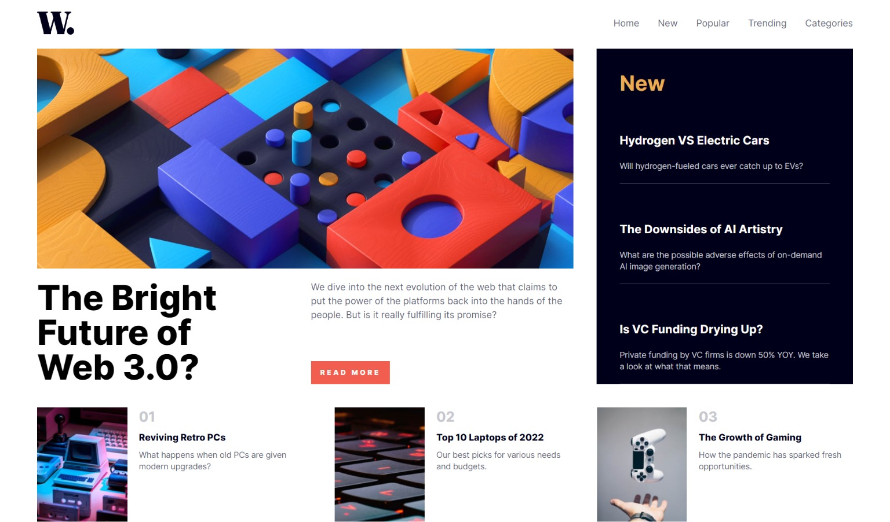

# Frontend Mentor Challenge: News Homepage



This project is a solution to the "News Homepage" challenge from Frontend Mentor. It provides an opportunity to enhance your CSS Grid skills by creating a responsive news homepage with a focus on layout and design.


## Overview

The "News Homepage" challenge is a Frontend Mentor project designed to test and improve your CSS Grid skills. The goal is to create a responsive news homepage with a focus on layout and design. This project is built using Vite, React, and Tailwind CSS.

## Screenshot


## Features

- Responsive design for various screen sizes
- Utilizes CSS Grid for flexible layout
- Seamless integration of Tailwind CSS for styling
- React components for modular and maintainable code

## Technologies Used

- [Vite](https://vitejs.dev/)
- [React](https://reactjs.org/)
- [Tailwind CSS](https://tailwindcss.com/)

## Installation

1. Clone the repository:

```bash
git clone https://github.com/KamalJoshi-web/news-homepage.git
cd news-homepage
```

2. Install dependencies:

```bash
npm install
```

## Usage

1. Start the development server:

```bash
npm run dev
```

2. Open your browser and visit [http://localhost:3000](http://localhost:3000) to view the News Homepage.


## Acknowledgements

This project was built as a solution to the "News Homepage" challenge by Frontend Mentor. Visit [Frontend Mentor](https://www.frontendmentor.io/challenges) for more challenges and to improve your frontend skills.

